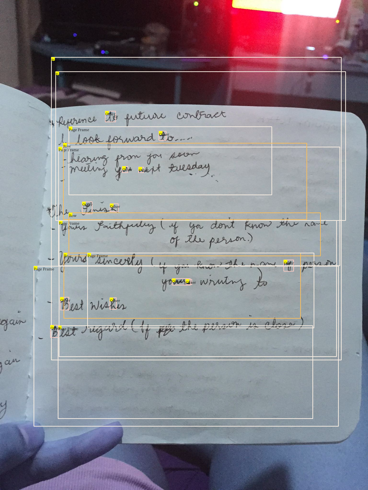

# Handwritten Document Conversion

## Introduction

In today's digital age, vast amounts of information are stored in handwritten documents, ranging from historical manuscripts and personal notes to medical records and legal documents. While digitization has preserved these valuable texts, their handwritten nature poses a significant challenge for accessibility and searchability. Unlike typed text, handwritten content is often difficult to search, analyze, and utilize efficiently. This limitation hinders researchers, professionals, and the general public from extracting meaningful information and insights from these documents.

The project aims to address this challenge by developing a robust solution for converting digitized handwritten text into searchable text. By leveraging advanced techniques in machine learning and optical character recognition (OCR), this project seeks to create an automated system capable of accurately transcribing handwritten content. The goal is to enhance the usability of digitized handwritten documents, making them fully searchable and accessible, thereby unlocking their full potential for knowledge discovery and practical applications.

## Goals

1. Developing an accurate and efficient conversion pipeline specifically tailored for handwritten text.
1. Ensuring high transcription accuracy across various styles of handwriting.
1. Creating a user-friendly interface for seamless integration and utilization of the transcribed text.
1. Addressing challenges related to the diversity and variability of handwriting.

> By successfully converting handwritten documents into searchable text, this project will facilitate easier access to valuable information, promote historical and academic research, and enhance the productivity of professionals who rely on handwritten records.

## Contributors

1. Nikin Baidar
1. Nimesh Gopal Pradhan
1. Paras Pujara

## Project Architecture

# Status

For initial steps, we do not want to detect the words and titles or subtitles, we just want
to detect individual paragraphs. This will be more useful in many use cases in
handwritten documents.

## Known Issues

1. Layout parser is not smart enough to separate background in an image from
   the page frame. See .
   Inputs/training set might need to be preprocessed before fine tuning.

1. Layout parser's detection model is able to detect the models all right but
   no text extraction. 

1. The Tesseract OCR engine works well on scanned images of printed documents
   but does not perform good at all with handwritten images.

## High Level Next Steps

# Usage
## Installation
To begin this project, use the included `Makefile`

#### Creating Virtual Environment

This package is built using `python-3.11`. 

We recommend creating a virtual environment and using a matching version to ensure compatibility.

#### pre-commit

`pre-commit` will automatically format and lint your code. You can install using this by using
`make use-pre-commit`. It will take effect on your next `git commit`

#### pip-tools

The method of managing dependencies in this package is using `pip-tools`. To begin, run `make use-pip-tools` to install. 

Then when adding a new package requirement, update the `requirements.in` file with 
the package name. You can include a specific version if desired but it is not necessary. 

To install and use the new dependency you can run `make deps-install` or equivalently `make`

If you have other packages installed in the environment that are no longer needed, you can you `make deps-sync` to ensure that your current development environment matches the `requirements` files. 

## Usage Instructions

# Data Source
## Code Structure
## Artifacts Location

# Results
## Metrics Used
## Evaluation Results
